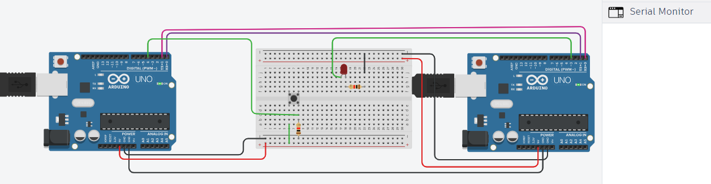
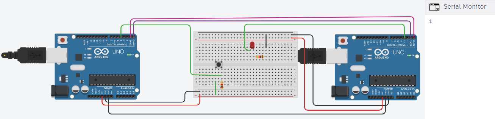

# Task2-IOT

## Communication between two Arduinos by Serial UART

 ### What is UART?
 UART is a type of serial communication protocol that allows two devices to exchange data over a single communication line with serial communication.

 UART uses two wires for communication: a transmit line (TX) and a receive line (RX). The Rx of the second microcontroller connects with the Tx of the first. When one 
 device wants to send data to the other, it transmits a series of bits over the TX line, with each bit being sent sequentially. The receiving device then reads these bits 
 from the RX line and interprets them as data.

 ### Idea:
  - Link the two Arduino boards through UART TX (transmitter) and RX (receiver) .
  - Power on the LED when the button is pressed, and power off the LED when the button is not pressed.

 ### Hardware Required:
  - 2 Arduino UNO.
  - Breadboard.
  - LED.
  - Push button.
  - 2*220 Ohm resistors.
  - wires.

  ### Circuit:

  - When the button is not pressed:
 
      
 
  - When the button is pressed:
    
      


  ### Code:

```
// Arduino 1

void setup() {
  
  pinMode(4, INPUT);
  Serial.begin(9600);
  
}

void loop() {
  
  int buttonState = digitalRead(4);

  if (buttonState == HIGH )
  {
     Serial.println(buttonState); 
     delay(2000);
  }
  
}
```

```
// Arduino 2

void setup() {
  pinMode(3, OUTPUT);
  Serial.begin(9600);
}

void loop() {
  
   
  if (Serial.available()) 
  {
    int buttonState = Serial.read();
    
    if (buttonState == '1')
    {
      digitalWrite(3, HIGH);
      delay(2000);
    }
    else
    {
      digitalWrite(3, LOW);
    }
    
  }

}

```
